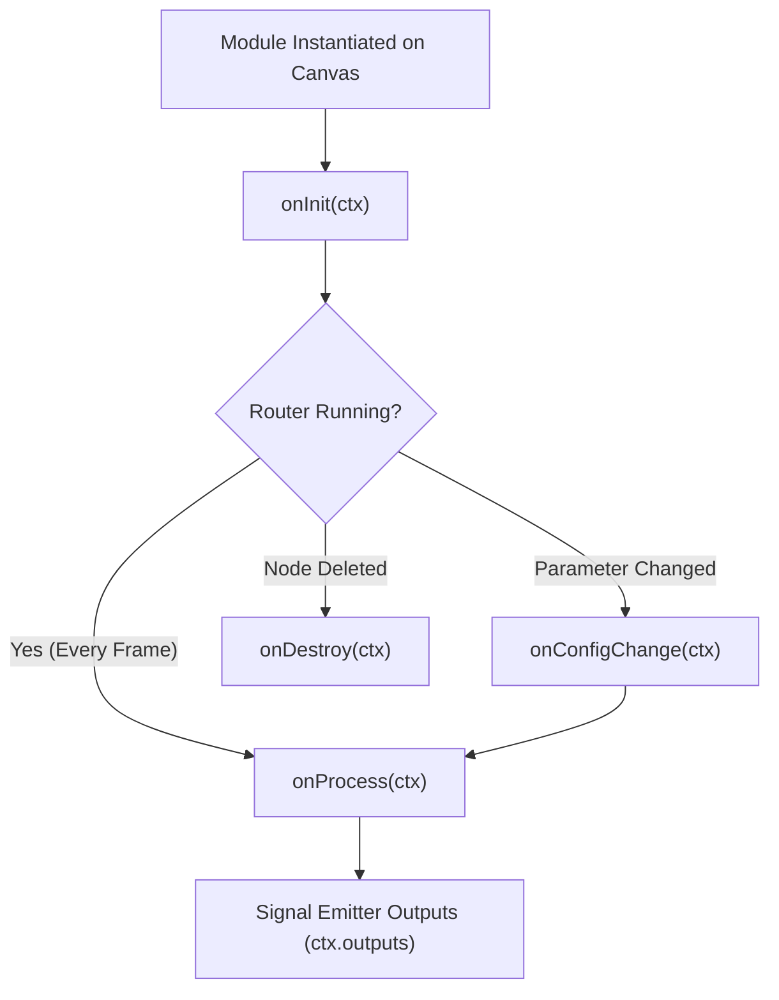

# VRC-Flow Standard Library SDK & Math Modules Reference Guide

Welcome to the **VRC-Flow Standard Library SDK** documentation. This guide details the lifecycle hooks, context APIs, signal emitters, math utilities, and standard module presets available for creating custom signal processing modules in **TypeScript** (`@vrc-flow/sdk`) and **Rust** (`vrc_flow_core`).

---

## 📚 1. Standard Library SDK Overview

VRC-Flow provides a type-safe standard library for custom signal nodes. Authors can write logic in either TypeScript or Rust to process high-frequency VRChat OSC parameters, avatar tracking inputs, sensor telemetry, and AudioLink spectrum streams.

### File Structure & Imports
- **TypeScript**: `import { VRCModule, ModuleContext, VRCMath } from '@vrc-flow/sdk'`
- **Rust (WASM Core)**: `use vrc_flow_core::{VRCModule, ModuleContext, SignalValue, VRCMath};`

---

## 🔄 2. Module Lifecycle Hooks

Modules declare lifecycle methods that VRC-Flow triggers during the graph execution loop:



### A. `onInit(ctx: ModuleContext)` *(Optional)*
- **Trigger**: Called once when the module node is first instantiated or restored on the canvas.
- **Use Case**: Allocate internal state buffers, initialize default parameters, or prepare lookup tables.

```typescript
onInit(ctx: ModuleContext) {
  ctx.log('Eye Damping Module Initialized');
  this.previousValue = 0.0;
}
```

---

### B. `onProcess(ctx: ModuleContext)` *(Mandatory)*
- **Trigger**: Executed on every engine evaluation tick (up to 144 Hz).
- **Use Case**: Read incoming signal inputs (`ctx.inputs`), apply mathematical transformations, and emit outputs (`ctx.outputs`).

```typescript
onProcess(ctx: ModuleContext) {
  const rawInput = Number(ctx.inputs.in_val) || 0.0;
  const speed = Number(ctx.params.smoothing_speed) || 10.0;

  // Exponential smoothing calculation
  this.currentVal = VRCMath.lerp(this.currentVal, rawInput, ctx.deltaTime * speed);

  // Emit to output handle
  ctx.outputs.out_val(this.currentVal);
}
```

---

## 🧮 3. Basic Math Operations & VRCMath Helpers

VRC-Flow includes built-in basic math nodes and `VRCMath` standard library helpers:

### Basic Arithmetic Methods:
- **`VRCMath.add(a, b)`**: Addition ($A + B$)
- **`VRCMath.sub(a, b)`**: Subtraction ($A - B$)
- **`VRCMath.mul(a, b)`**: Multiplication ($A \times B$)
- **`VRCMath.div(a, b)`**: Division ($A / B$, safe divide returning `0.0` when $B = 0$)
- **`VRCMath.mod(a, b)`**: Modulo ($A \pmod B$)
- **`VRCMath.pow(a, b)`**: Exponentiation ($A^B$)
- **`VRCMath.min(a, b)`**: Minimum value ($\min(A, B)$)
- **`VRCMath.max(a, b)`**: Maximum value ($\max(A, B)$)
- **`VRCMath.abs(val)`**: Absolute value ($|A|$)

### Signal Processing Utilities:
- **`VRCMath.clamp(val, min, max)`**: Clamps `val` within $[min \dots max]$.
- **`VRCMath.lerp(a, b, t)`**: Linear interpolation between $a$ and $b$ by factor $t$.
- **`VRCMath.smoothStep(min, max, val)`**: Smooth Hermite interpolation between $0.0$ and $1.0$.
- **`VRCMath.deadzone(val, threshold)`**: Noise gate returning `0.0` if $|val| < threshold$.
- **`VRCMath.remap(val, inMin, inMax, outMin, outMax)`**: Linear range remapping $[In \rightarrow Out]$.
- **`VRCMath.quantize(val, step)`**: Step-snapping / quantizing continuously varying signals.

---

## 🚀 4. Proposed Standard Modules Library

Below is the extended suite of specialized modules for VRChat creators:

### A. 👁️ Eye Tracking & Facial Animation Modules
1. **Dual Eye Convergence & Pupil Synchronizer**:
   - Calculates 3D gaze convergence distance and outputs pupil dilation & convergence blendshapes.
2. **Lip Sync & Viseme Decoder**:
   - Converts 15 VRChat Viseme indices or audio volume levels into smooth mouth shapekeys.
3. **Micro-Saccade Idle Generator**:
   - Adds realistic micro-saccade eye twitches when avatar eye tracking is idle.

### B. 💓 Biometrics & Health Hardware Modules
1. **Heart Rate Zone Color Mapper**:
   - Maps Heart Rate BPM (Pulsoid / Smartwatch) to avatar emissive shader color ramps.
2. **Heartbeat Pulse BPM Generator**:
   - Synthesizes real-time heart rate pulse wave signals for lilToon AudioLink or emissive shader pulsing.
3. **Respiration Rate Wave Generator**:
   - Generates a smooth breathing sine wave (12–18 breaths/min) for chest blendshape expansion.

### C. 🎵 AudioLink & Music Reactivity Modules
1. **4-Band Frequency Splitter**:
   - Separates Bass, Low-Mid, High-Mid, and Treble spectrum levels into discrete node outputs.
2. **BPM Clock & Beat Snap**:
   - Generates tempo-synchronized trigger pulses (`1/4`, `1/8`, `1/16` notes) based on live BPM tracking.
3. **Volume Peak Strobe Gate**:
   - Triggers clothing lighting when audio volume exceeds configurable threshold with decay tail.

### D. 🕹️ VR Controller & Tracking Calibration Modules
1. **Joystick Deadzone & Curve Mapper**:
   - Applies S-curve exponential sensitivity scaling and deadzones to VR thumbsticks.
2. **Gestural Combo Trigger**:
   - Combines left/right hand gesture integers (e.g. Left Fist + Right Pointing = Spell Cast Trigger).

### E. 🔮 Shader & lilToon Material Modulation Modules
1. **MatCap Color Hue Animator**:
   - Continuously rotates lilToon MatCap `hueShift` over time for rainbow chrome avatar surfaces.
2. **Rim Light Pulse Modulator**:
   - Modulates lilToon `rimFresnelPower` and `rimColor` in response to avatar parameters or music.
3. **Glitter Sparkle Burst Trigger**:
   - Temporarily boosts lilToon `glitterDensity` and `glitterBlinkSpeed` during avatar emotes.

---

## 📦 5. Exporting & Sharing (`.vrcm`)

Custom modules can be exported into single-file `.vrcm` JSON packages directly from VRC-Flow:

1. Click **"Custom Module Studio"** in the top bar.
2. Write or paste your module code.
3. Click **"Export .vrcm Package"**.
4. Share the resulting `.vrcm` file with other VRChat creators. They can drag-and-drop it into their canvas using **"Import Module"**.
