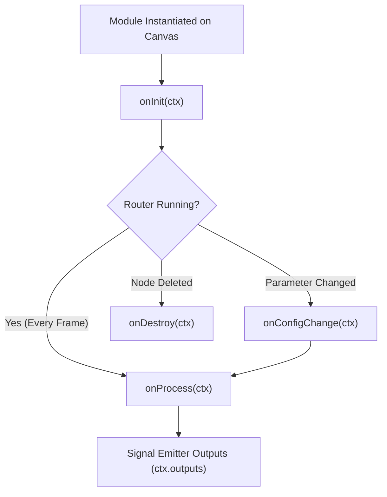

# VRC-Flow Standard Library SDK & Math Modules Reference Guide

Welcome to the **VRC-Flow Standard Library SDK** documentation. This guide details the lifecycle hooks, context APIs, signal emitters, math utilities, and standard module presets available for creating custom signal processing modules in **TypeScript** (`@vrc-flow/sdk`) and **Rust** (`vrc_flow_core`).

---

## 📚 1. Standard Library SDK Overview

VRC-Flow provides a type-safe standard library for custom signal nodes. Authors can write logic in either TypeScript or Rust to process high-frequency VRChat OSC parameters, avatar tracking inputs, sensor telemetry, and AudioLink spectrum streams.

### File Structure & Imports
- **TypeScript**: `import { VRCModule, ModuleContext, VRCMath } from '@vrc-flow/sdk'`
- **Rust (WASM Core)**: `use vrc_flow_core::{VRCModule, ModuleContext, SignalValue, VRCMath};`

---

## 🔄 2. Module Lifecycle Hooks

Modules declare lifecycle methods that VRC-Flow triggers during the graph execution loop:



### A. `onInit(ctx: ModuleContext)` *(Optional)*
- **Trigger**: Called once when the module node is first instantiated or restored on the canvas.
- **Use Case**: Allocate internal state buffers, initialize default parameters, or prepare lookup tables.

```typescript
onInit(ctx: ModuleContext) {
  ctx.log('Eye Damping Module Initialized');
  this.previousValue = 0.0;
}
```

---

### B. `onProcess(ctx: ModuleContext)` *(Mandatory)*
- **Trigger**: Executed on every engine evaluation tick (up to 144 Hz).
- **Use Case**: Read incoming signal inputs (`ctx.inputs`), apply mathematical transformations, and emit outputs (`ctx.outputs`).

```typescript
onProcess(ctx: ModuleContext) {
  const rawInput = Number(ctx.inputs.in_val) || 0.0;
  const speed = Number(ctx.params.smoothing_speed) || 10.0;

  // Exponential smoothing calculation
  this.currentVal = VRCMath.lerp(this.currentVal, rawInput, ctx.deltaTime * speed);

  // Emit to output handle
  ctx.outputs.out_val(this.currentVal);
}
```

---

### C. `onConfigChange(ctx: ModuleContext)` *(Optional)*
- **Trigger**: Fired when the user adjusts a slider, toggle, or text input in the node's Inspector panel.
- **Use Case**: Recompute filter coefficients or reset internal accumulators.

---

### D. `onDestroy(ctx: ModuleContext)` *(Optional)*
- **Trigger**: Fired when the node is deleted from the React Flow canvas.
- **Use Case**: Release resources, timers, or state handlers.

---

## 🎛️ 3. ModuleContext API Reference

The `ModuleContext` object provides full access to incoming signals, UI parameter settings, frame timing, and AudioLink reactive telemetry.

| Property | Type | Description |
| :--- | :--- | :--- |
| `ctx.inputs` | `Record<string, SignalValue>` | Dictionary of incoming values from connected handles. |
| `ctx.outputs` | `Record<string, (val) => void>` | Helper functions to emit signals to output handles. |
| `ctx.params` | `Record<string, any>` | User-configurable parameter values set in the Inspector. |
| `ctx.time` | `number` | Total engine uptime in seconds (`f32`). |
| `ctx.deltaTime` | `number` | Time elapsed since the last evaluation frame (e.g. `0.016` for 60 FPS). |
| `ctx.audioLinkPulse` | `number` | Live VRChat AudioLink reactivity pulse (`0.0` to `1.0`). |
| `ctx.log(msg)` | `(msg: string) => void` | Appends a debug message to the node's live telemetry log. |

---

## 🧮 4. Basic Math Operations & VRCMath Helpers

VRC-Flow includes built-in basic math nodes and `VRCMath` standard library helpers:

### Basic Arithmetic Methods:
- **`VRCMath.add(a, b)`**: Addition ($A + B$)
- **`VRCMath.sub(a, b)`**: Subtraction ($A - B$)
- **`VRCMath.mul(a, b)`**: Multiplication ($A \times B$)
- **`VRCMath.div(a, b)`**: Division ($A / B$, safe divide returning `0.0` when $B = 0$)
- **`VRCMath.mod(a, b)`**: Modulo ($A \pmod B$)
- **`VRCMath.pow(a, b)`**: Exponentiation ($A^B$)
- **`VRCMath.min(a, b)`**: Minimum value ($\min(A, B)$)
- **`VRCMath.max(a, b)`**: Maximum value ($\max(A, B)$)
- **`VRCMath.abs(val)`**: Absolute value ($|A|$)

### Signal Processing Utilities:
- **`VRCMath.clamp(val, min, max)`**: Clamps `val` within $[min \dots max]$.
- **`VRCMath.lerp(a, b, t)`**: Linear interpolation between $a$ and $b$ by factor $t$.
- **`VRCMath.smoothStep(min, max, val)`**: Smooth Hermite interpolation between $0.0$ and $1.0$.
- **`VRCMath.deadzone(val, threshold)`**: Noise gate returning `0.0` if $|val| < threshold$.
- **`VRCMath.remap(val, inMin, inMax, outMin, outMax)`**: Linear range remapping $[In \rightarrow Out]$.
- **`VRCMath.quantize(val, step)`**: Step-snapping / quantizing continuously varying signals.

---

## 💻 5. Complete Copy-Paste Examples

### Example 1: TypeScript Signal Damping Module (`EyeDamping.ts`)

```typescript
import { VRCModule, ModuleContext, VRCMath } from '@vrc-flow/sdk';

export default class EyeDampingModule extends VRCModule {
  readonly meta = {
    id: 'com.user.eye-damping',
    name: 'Eye Damping & Smoothing',
    version: '1.0.0',
    category: 'Tracking' as const,
    inputs: [
      { id: 'raw_eye', name: 'Raw Eye Input', type: 'float' as const, direction: 'input' as const },
    ],
    outputs: [
      { id: 'smooth_eye', name: 'Smoothed Output', type: 'float' as const, direction: 'output' as const },
    ],
    parameters: [
      { id: 'speed', label: 'Filter Speed', type: 'range' as const, default: 8.0, min: 1.0, max: 30.0 },
    ],
  };

  private current = 0.0;

  onInit(ctx: ModuleContext) {
    this.current = 0.0;
  }

  onProcess(ctx: ModuleContext) {
    const raw = Number(ctx.inputs.raw_eye) || 0.0;
    const speed = Number(ctx.params.speed) || 8.0;

    // Apply exponential smoothing with delta time
    this.current = VRCMath.lerp(this.current, raw, ctx.deltaTime * speed);

    // Emit smoothed float to output handle
    ctx.outputs.smooth_eye(this.current);
  }
}
```

---

### Example 2: Rust WASM Noise Filter Module (`HeartRateFilter.rs`)

```rust
use vrc_flow_core::{VRCModule, ModuleContext, SignalValue, VRCMath};
use wasm_bindgen::prelude::*;

#[wasm_bindgen]
pub struct HeartRateFilter {
    filtered_bpm: f32,
}

#[wasm_bindgen]
impl HeartRateFilter {
    #[wasm_bindgen(constructor)]
    pub fn new() -> Self {
        Self { filtered_bpm: 70.0 }
    }
}

impl VRCModule for HeartRateFilter {
    fn process(&mut self, ctx: &mut ModuleContext) {
        if let Some(SignalValue::Float(raw_bpm)) = ctx.inputs.get("hr_input") {
            let speed = 5.0;
            self.filtered_bpm = VRCMath::lerp(self.filtered_bpm, *raw_bpm, ctx.delta_time * speed);
            ctx.outputs.insert("clean_bpm".to_string(), SignalValue::Float(self.filtered_bpm));
        }
    }
}
```

---

## 🚀 6. Recommended Standard Modules

Below are essential pre-built modules for VRChat avatar control pipelines:

1. **Viseme & Gesture Decoder Module**:
   - Maps integer gesture states ($0 \dots 7$) to individual VRChat expression shapekeys.
2. **Exponential Damping Filter**:
   - Smooths jerky tracker or VR controller inputs with adjustable time constant.
3. **Hysteresis Threshold Trigger**:
   - Dual-threshold gate preventing rapid ON/OFF flickering near cut-off boundaries.
4. **AudioLink Frequency Splitter**:
   - Separates AudioLink bass, low-mid, high-mid, and treble pulses into distinct parameter triggers.

---

## 📦 7. Exporting & Sharing (`.vrcm`)

Custom modules can be exported into single-file `.vrcm` JSON packages directly from VRC-Flow:

1. Click **"Custom Module Studio"** in the top bar.
2. Write or paste your module code.
3. Click **"Export .vrcm Package"**.
4. Share the resulting `.vrcm` file with other VRChat creators. They can drag-and-drop it into their canvas using **"Import Module"**.
